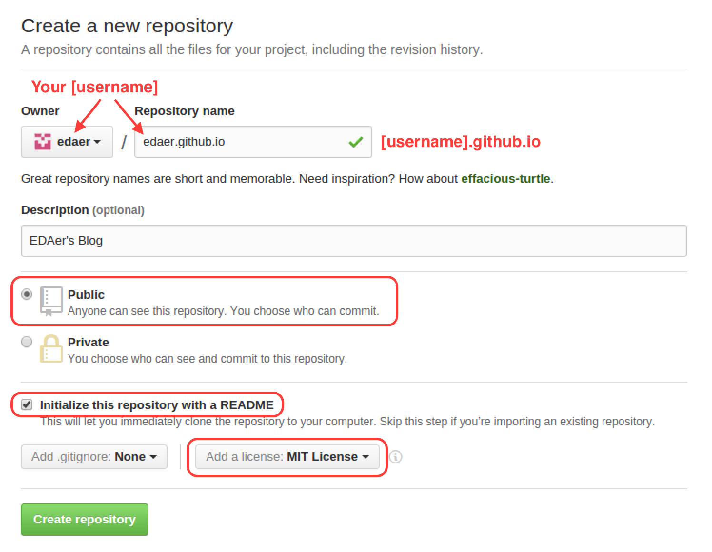
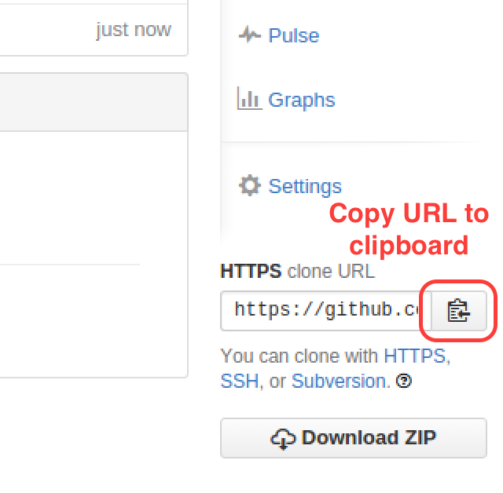

Publish a user site on GitHub
=================================

## Create the repository

1. Create a [new website repository](https://github.com/new).

This will take you to the new repository form.

2. Fill out the new repository form.

 * You *MUST* name your repository *[USERNAME].github.io*
 * Make your repository *public*
 * Select the check to be sure you *Initialize this repository with a README*
 * select the *MIT License*.
 * *Double check* your username in the repository name is _exactly_ the same as your username.



3. Click on the "*Create Repository*" button.

## Clone the repository

1. Copy the URL of the new repo to the clipboard.



2. In the `~/workspace` folder in your terminal, run:

```bash
    git clone [paste the URL here with SHFT-CTRL-v]
```

## Publish a page

1. Navigate to the folder for the repo.

```bash
    cd [username].github.io
```

2. Create a very basic web page.

```bash
    echo "Web development FTW" > index.html
```

3. Stage your changes.

```bash
    git add .
```

4. Commit your changes.

```bash
    git commit -m "initial commit"
```

5. Push your new commit to GitHub.

```bash
    git push origin master
```

## View your creation

1. Navigate to [your-username].github.io and revel in your awesomeness.

2. If you have time, make some changes to your `index.html` file and re-publish the changes.

## More information

* [GitHub Pages](https://pages.github.com/)
