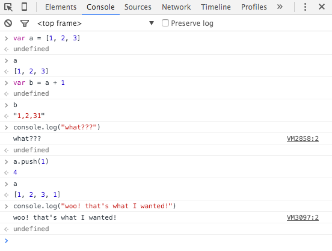
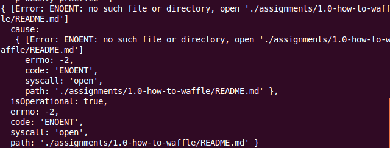

# Problem Solving

> Never trust a computer you can't throw out a window. - Steve Wozniak

## Capabilities
You are comfortable:

 - Persevering with a tough problem  
 - Using strategies to solve a tough problem  
 - Recognising when it's time to ask for help  

## Overview
At EDA (and as a professional developer) you'll be constantly facing challenging problems! Tough problems are the best learning opportunities. 

There are many strategies for resolving problems. Having a methodical strategy keeps you calm and productive, so you can avoid a black hole of frustration.

## Steps

If your code is not properly formatted before starting this process, _do that first_! We can't emphasise this enough. Properly formatted code will allow you to see your work (and that of others) more clearly. It will make some mistakes obvious, and reduce the chance of making others. Here are some other steps to try:

1. Pseudocode
2. Try something!
3. Simplify
4. Read error message
5. Improve visibility of problems using console output
6. Debuggers: 
  * Chrome, Firefox, Edge or Safari dev tools
  * IDEs: WebStorm and VS Code both feature JavaScript debugging
  * Node has its own [debugger](https://nodejs.org/api/debugger.html)
7. Rubber ducky
8. Google
9. Blocked? Ask peers on cohort Slack
10. Still blocked? Tag a coach
11. Reflect

### 1. Pseudocode**    
First step: don't code - you'll get tied up in syntax and minor details. Work out what you actually want to do by [pseudocoding](/concepts/pseudocode). Get up. Go for a walk. Think about it.

### 2. Try Something!  
It won't work (95% of the time). Great! Some code is better than no code. Now we've got some errors (bugs) to work with. We're now in the land of _debugging_!
If you don't know how to approach the problem with code, Google the logic of your pseudocode for ideas.

Use the console in your browser, a REPL like ([JS Fiddle](https://jsfiddle.com) or [JS Bin](https://jsbin.com)), or the Node REPL (type `node` in a terminal) to explore the behaviour of functions you think might help.
<figure>
   
  <figcaption>
    
<strong>Figure 1:</strong> Exploring JS behaviour in the browser console

  </figcaption>
</figure>

Whatever you do, _don't_ write a whole bunch of code before you test it! Make _small_ changes, and see what their effect is. Then change something else, and see what that does. If you change too much at once, it'll be harder for you to identify what's caused a new problem when, inevitably, one emerges. Don't forget to make small Git commits as you go along.

### 3. Simplify

The first step to resolving a problem is isolating the code that caused it. Once you know _where_ a problem is you can set about fixing it! This can be intimidating when you're faced with a large mass of unruly functions.

Pare down. Go back to the last point where you know your code was working, and make small changes until it breaks again. The last change that you introduced either caused the problem, or makes apparent a problem that was introduced earlier.

### 4. Read the error message

If you have one. Your browser (or Node) is trying to tell you how to fix the problem! Don't be intimidated by long, complex output. Scan the output for files, line numbers, or messages that may show you exactly what's going wrong. 
Look for line numbers in files you recognise.
<figure>
   
  <figcaption>
    
<strong>Figure 1:</strong> An app trying to tell us it can't find a directory (amongst many other strange unrecognisable messages). Perhaps the filepath we're giving it is wrong...?

  </figcaption>
</figure>
The complexity of error messages, particularly stack traces, can be overwhelming. Recognise that feeling of frustration if it starts to rise as you look at all that red text! This is often a really good moment to practise breathing and mindfulness. Sure, there's an error... but you'll deal with it. You're not the first developer ever to be faced with this error, and you won't be the last. No matter what happens, you and your team can handle it.

### 5. Improve visibility of problems using console output

Remove your assumptions about the values of your variables - use `console.log` to inspect their value at the various stages of your code, and test the behaviour of your logic. 

### 6. Debuggers

Console output is all very well, but modern browsers and development environments are capable of debugging JavaScript code as it is running. Try adding a `debugger` statement above the code you suspect is causing your problem. This will allow you to step through the code and look at the values of variables and return values from functions. 

### 7. Rubber ducky

<figure>
   
  <figcaption>
    
<strong>Figure 1:</strong> Rubber ducky: yellow plastic debugging tool.

  </figcaption>
</figure>
A surprisingly powerful technique, [rubber duck debugging](https://en.wikipedia.org/wiki/Rubber_duck_debugging) is the act of explaining your difficulty to an inanimate object (traditionally, a little yellow rubber ducky placed next to your monitor). Explain to your rubber ducky: 
 * What is the problem? 
 * What do I know? 
 * What don't I know?

Some developers find that they've already solved the problem by the time they finish their explanation. (If you're self-conscious, you can always go to the bathroom or for a little walk outside to avoid peer scrutiny!)

### 8. Google  
There is absolutely nothing wrong with researching a problem on Google. Programmers at the highest level of development do it all the time. The true crime would be to have a massive resource of knowledge at your disposal, and _not_ to use it!

Forming the correct search can be tricky, especially as a beginner. It can be hard to even verbalize what you don’t understand. Even if it seems fruitless, put together a few key words: it’s likely some answer will be returned. 

For example, say you can’t figure out how to get the last element out of a JavaScript array. Feeling foolish, you try Googling “get last thing in array javascript” - this actually returns perfectly valid results.

If you have an error message that is more specific than "undefined is not a function", try searching on that too. Use the generic part of the error message: those words and phrases that don't refer specifically to your program, or variable names you've chosen. Chances are searches that refer to `arr1` and `arr2` are going to return an awful lot of results that don't apply to your particular situation because millions of developers use similar names.

It has been said that programming is being paid to be frustrated and confused. So good luck with your problem solving!

### 9. Blocked? Ask peers on cohort Slack

If you've been problem solving for over 15 mins and you feel like you've hit a dead end, post a message in your cohort Slack channel. It's likely someone else has had and resolved a similar issue, or has the perspective, understanding or experience to help you resolve your issue.

Students are sometimes reluctant to do this, for a variety of reasons:
 * "I don't want to take up their time"
 * "I don't them to think I'm not as smart as they are"
 * "I'm ashamed of how long this is taking me"
 * "I've already asked for help three times this week!"

It's human nature to want to be independent, but this attitude can sometimes slow you down, and in an industry context it can slow down an entire team. Consider, what if by remaining quiet you're denying another team member the opportunity to become a better teacher? What if the answer is something you couldn't possibly have known, but another developer has learned only through long and painful experience? What if someone else has the exact same problem and could benefit from your speaking up?

What if the team becomes stronger when we admit we don't know something?

We like to emphasise the team as a powerful tool for problem solving because we want teams in the industry to be like this, and we believe that the first step is to train each other to reach out, to depend on each other, to be greater than the sum of their parts.

### 10. Still blocked? Tag a coach
We recognise that there are some problems that can't be solved within the context of the team. If your cohort can't help you, or you feel a concept needs more clarification, tag a teacher in Slack. We'll try to help out as soon as possible. To be of most help, there are a few things you can do to reduce the time it takes us to understand your problem:

1. _Format your code_. Did we mention that already? Maybe once or twice.
2. Don't post screenshots of code. Screenshots are pretty but can't be copied, pasted, or scrolled. Post snippets, excerpts surrounded by triple backtick, [gists](https://gist.github.com), or just a link to the file in your repository on GitHub.
3. Explain simply and clearly:
  * What you _expect_ the code to do
  * What it _actually_ does
  * Any error messages you receive

### 11. Reflect  

Sometimes it's tempting to charge ahead, steamroller-like, once you've finally managed to kick that pesky problem to the curb. We suggest, first and foremost, you're probably due a break! Stand up, relax, stretch, breathe. And consider:
 * Which approaches worked well?    
 * What did I get stuck on?   
 * Why did it take so long to resolve a silly bug? A common question!   
 * How long did it take to isolate the bug?  
 * Did I stay calm?  
 * Did my mindset help or hinder me?  
 * What were the troubleshooting strategies/patterns that helped (or could have helped) that I should consider for the future?

As you become more experienced others will turn to you for assistance with their problems. This may start to happen even in later phases of EDA. With that in mind, ask yourself:
 * Who were the people I found most helpful? 
 * What was their demeanour like? 
 * Which resources did they consult? 
 * What debugging tools did they recommend?
 * What could I learn from their method when someone comes to _me_ for help?

## Resources
- [Rubber duck debugging](https://en.wikipedia.org/wiki/Rubber_duck_debugging)
- [Debugging JavaScript (Chrome dev tools)](https://developer.chrome.com/devtools/docs/javascript-debugging)
- [Debugger (Edge dev tools)](https://developer.microsoft.com/en-us/microsoft-edge/platform/documentation/f12-devtools-guide/debugger/)
- [Debugger (Firefox dev tools)](https://developer.mozilla.org/en-US/docs/Tools/Debugger)
 
## Further Study
- [JavaScript Debugging Tips and Tricks](http://www.zsoltnagy.eu/javascript-debugging-tips-and-tricks/)
