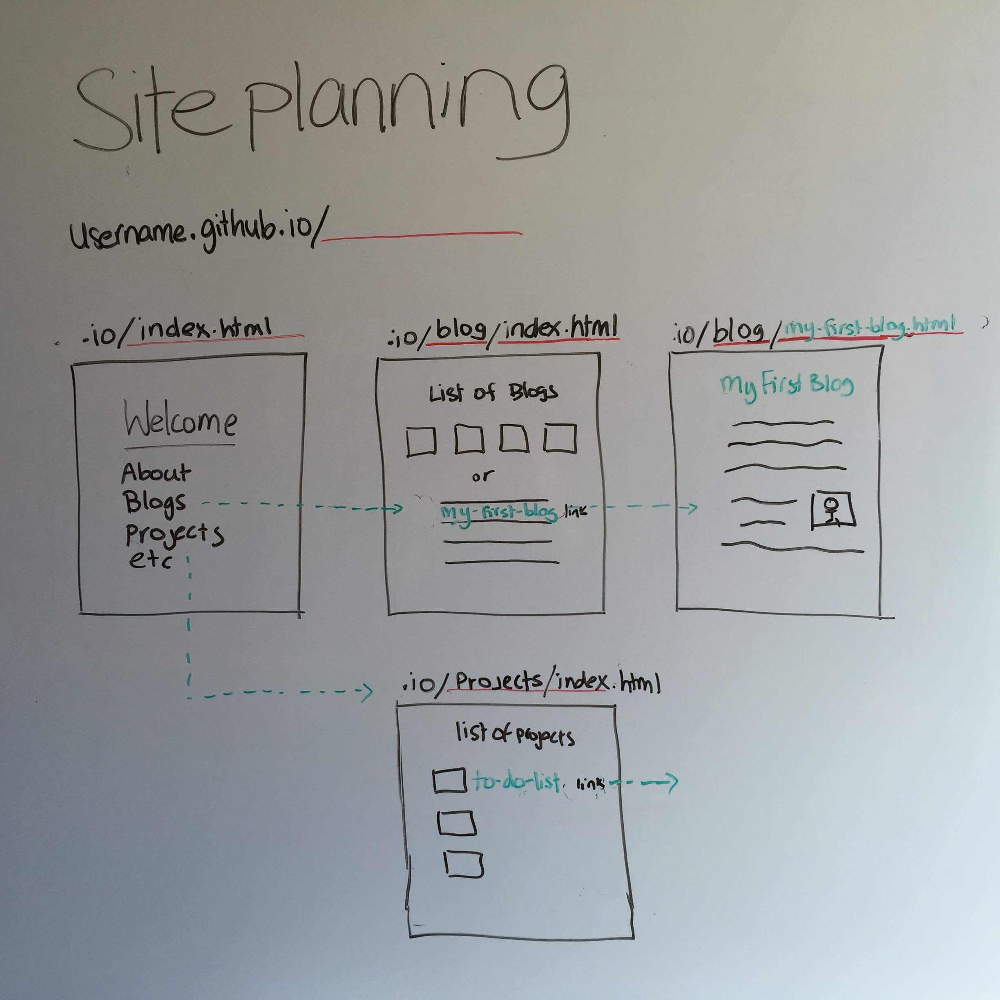
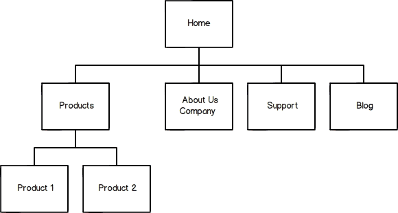

# Site planning and Wireframing Tutorial

## Overview
[Process is important](../design-process-ARTICLE) In this tutorial you will develop a site plan and wireframes for your Dev Academy website.

## Site plan
Your website will become a collection of your Dev Academy work. Initally it will feature a blog, a profile and links to projects, but as you progress, you can develop and transform your site in many ways see student blog examples (below)

Think about the purpose of your website and who you want to visit it. Potential employers will often seek out a candidates online profile and blogs to learn a little about your process and your experiences. Do you want to be designing your site with this in mind? Or do you want to use it simply as a means to complete your assignments.

Your website will have many directories, many html files and possibly (if your website were to become large) a few CSS files.
A visitor to your site will view these files through the browsers URL.

For example:

- `username.github.io/index.html` (your home page)
- `username.github.io/blog/index.html` (the directory of your blogs)
- `username.github.io/blog/a-blog-you-wrote.html` ((a blog that you wrote)
  

<figure>
   
  <figcaption>
    
<strong>Figure 1:</strong> Planning your github.io website

  </figcaption>
</figure>

## Create a site map
- [ ] Draw a sitemap for your website

You will want to create a site map for your website. Don't worry about the design, you'll do this in the wireframe section. <!--DBC start--> For now, your site map will probably be really simple -- an index page with a few supplemental pages. But as you expand your portfolio and grow your site, you may find yourself adding more and more pages. The great thing about a site map is that it can grow and change with your website. We recommend you draw the map on paper, though you are also welcome to use tools such as Adobe Photoshop, [WriteMaps](https://www.writemaps.com/), or [Slickplan](http://slickplan.com/). **Don't spend too much time on this. Timebox 20 minutes max**

<figure>
   
  <figcaption>
    
<strong>Figure 2:</strong> Example site map

  </figcaption>
</figure>

<!--DBC end-->

## Create your wireframes
For each part of your website you will want a wireframe to describe the visual layout. Try to do these by hand.

- [ ] Watch this quick [video on wireframes](../design-wireframes-VIDEO)
- [ ] Wireframe your index page (save as wireframe-index-page)
- [ ] Wireframe your blog index page  (save as wireframe-blog-index)
- [ ] Wireframe your blog posts template (save as wireframe-blog-template)

<!-- DBC start -->
One of the first steps in creating a web page is to wireframe it. This process should also help you learn to separate different parts of a site (design vs. content, html vs. css, user interface vs. user experience) and learn the process of developing websites.

**It's easy to go down a rabbit hole while wireframing, so keep it simple and timebox yourself. A Wireframe doesn't have to be perfectly neat. Try to timebox the time you spend wireframing to one hour maximum.** We recommend drawing your wireframes on paper, but you can choose to use a [wireframing tool](http://mashable.com/2010/07/15/wireframing-tools/) if you like.

### 1. Wireframe your index page
The index is the homepage of your site. It's the page you will land on if you type in `**username**.github.io` into the browser so it's important it makes a good first impression. Consider how you want the index to look. You could be using this site to promote yourself when you finish Dev Academy, so at the very least, you should have a header, footer, and possibly maybe a navigation bar. You'll probably also want to include places for the some of the following:

  - Links to your social networks (Twitter, Facebook, LinkedIn, Quora, GitHub etc.)
  - Link to your contact information
  - Link to your blog/index.html page (this is where your links will be displayed)
  - Link to "About me"
  - Link to "Your projects"
  - Your picture

If your completing the wireframe assignment you will need to upload your wireframe to the directory specified in the assignment. Remember, wireframes don't need to be beautiful, they can be very simple as long as they get the idea of what you want your site to look like. Don't worry about actually creating any of these pages using HTML yet. You'll do that later.

- [ ] **Save an image of your index page wire frame as `wireframe-index-page` (it can be saved as png, jpg, etc.)**

### 2. Wireframe your `blog/index.html`
When people navigate to your blog from the main index of your `username.github.io site`, you will want them to see a list of your blog posts (not the posts themselves -- in some cases that would probably be ideal, but too tricky intially). This will be located at: `username.github.io/blog/index.html`

- [ ] **Save an image of your blog index wireframe as `wireframe-blog-index`**

### 3. Wireframe your blog posts
If you looked at your blog from week 1 on GitHub, it probably didn't strike you as particularly pretty, so you'll also want to consider how you will want each of your posts to look. How do you want to integrate them with your main site?

- [ ] **Design a wireframe for an individual post. You'll create the CSS to do this in a later assignment.**
- [ ] **Save an image of your blog wireframe-blog-template**

Remember to keep the wireframe fairly simple for now. You can always add to it later.

## Student blog examples

[Raza DBC](http://sjafri5.github.io/)  
[Nick's blog (EDA)](http://widdersh.in/)  
[Eugene's blog turned into an online portfolio (EDA)](http://euglazer.github.io/)  
[Jasmine (EDA)](http://jasminmayfield.github.io/)  
[Oli Treadwell turned his blog into a full website and purchased his own domain name (DBC)](http://www.olitreadwell.com/posts/)  
[Caroline (DBC) who also purchased her own domain name](http://car.oline.codes/)  
[Andrew's ](http://omgmakeme.github.io/index.html)  
[Fabi Castillo (DBC)](http://fab9.github.io/)  
[Beth Makes (DBC)](http://cynaria.github.io/)  
[Amelia (EDA)](http://amelialaundy.github.io/)  
