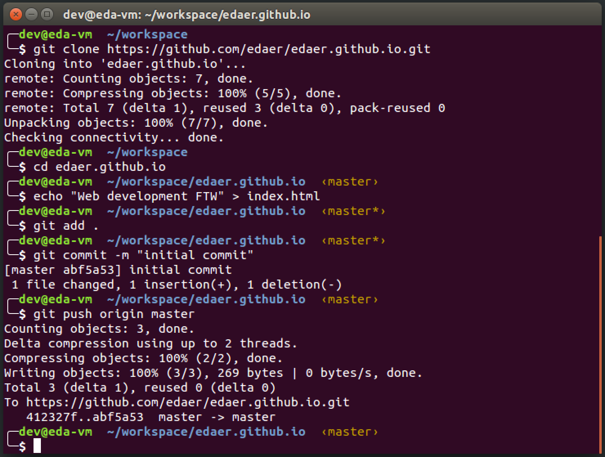

Publish a user site on GitHub
=================================

## Create the repository

* Create a [new website repository](https://github.com/new) (this will take you to the new repository form).

* Fill out the new repository form.

  - You **MUST** name your repository `[USERNAME].github.io`
  - Make your repository **public**
  - Select the check to be sure you **Initialize this repository with a README**
  - select the **MIT License**.
  - **Double check** your username in the repository name is _exactly_ the same as your username.


* Click on the "**Create Repository**" button.

## Clone the repository

* Copy the URL of the new repo to the clipboard.


* In the `~/workspace` folder in your terminal, run:

```bash
git clone [paste the URL here with SHFT-CTRL-v]
```

## Publish a page

* Navigate to the repo's folder.

```bash
cd [username].github.io
```

* Create a very basic web page.

```bash
echo 'Kia ora ao mārama (hello world!)' > index.html
```

* Stage your changes.

```bash
git add .
```

* Commit your changes.

```bash
git commit -m "initial commit"
```

* Push your new commit to GitHub.

```bash
git push origin master
```



## View your creation

* Navigate to https://[your-username].github.io and revel in your awesomeness.


* If you have time, make some changes to your `index.html` file and re-publish the changes.

## More information

* [GitHub Pages](https://pages.github.com/)
