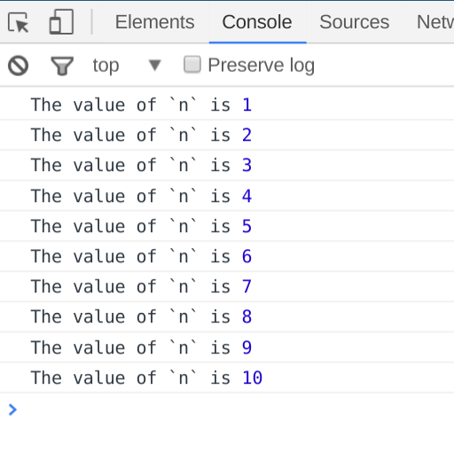
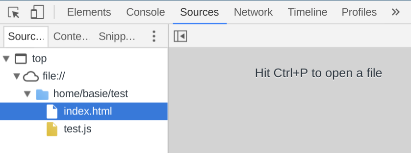
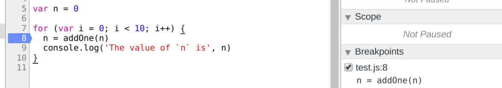
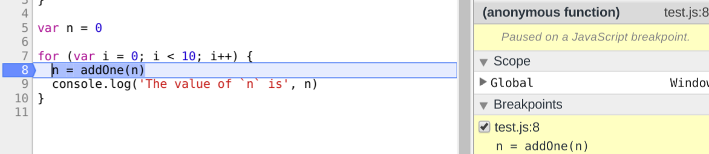
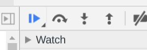

# Debugging

## Overview

You may have been using `console.log` statements to print out values from your program. While this works in a limited way, there is a much more powerful tool at our disposal: _the debugger_.


## Prerequisites

- You understand where the Chrome Dev Tools are and how to access them.


## Capabilities

You are comfortable with:

- Setting a breakpoint using the `debugger` keyword
- Stepping through statements one at a time using F10 and F11
- Stretch: 'Black-boxing' a source file so the debugger skips over it


## What's a debugger?

Debuggers give us a window into our code _while it's running_.

> "`console.log` is like shining a torch into a darkened room; using a debugger is like turning all the lights on." ~ Don Smith.

Using a debugger, we can _step_ through our program one line at a time and see what's actually going on. It may look intimidating at first, but it's tremendously useful. Many modern JavaScript programmers do not understand how to use debuggers: you are going to set yourselves apart!


## What does it look like?

Let's start with a really simple JavaScript source file, and an HTML file to run it in the browser:

```js
function addOne (n) {
  return n + 1
}

var n = 0

for (var i = 0; i < 10; i++) {
  n = addOne(n)
  console.log('The value of `n` is', n)
  document.write('The value of `n` is ', n, '<br>')
}
```

```html
<!DOCTYPE html>
<html>
  <head>
    <title>Debugging FTW</title>
    <script src="test.js"></script>
  </head>
  <body>
    Output:
  </body>
</html>
```

Save these files as `test.js` and `index.html` respectively. Load `index.html` in your browser and open the Chrome Dev Tools. Not sure how to do that? On OS X it'll be Cmd-Opt-J, on Windows or Linux it's going to be Ctrl-Shift-J. You should see something that looks a bit like this:

<figure>
  <br>
  <figcaption>
    <p>Opening the console.</p>
  </figcaption>
</figure>

If you've never used the console before, this is a tremendously useful part of the browser for developers! You can execute all kinds of handy JavaScript from here. As an experiment, try typing `n` at the prompt beneath the `console.log` statements. You should see it spit back, `n -> 10`. Try `n - 1`, `n++`, and so on.

Now click the `Sources` tab up the top of Dev Tools.

<figure>
  <br>
  <figcaption>
    <p>Opening the sources.</p>
  </figcaption>
</figure>


## Breakpoints

Ok. Don't hit Ctrl+P (or Cmd+P)! Instead, click on `test.js`. You should see the contents of your file.

Next, click on the line numbers inside the `for` loop (should be line 8). You'll see a blue arrow appear. Congratulations! You just set your first _breakpoint_.

<figure>
  <br>
  <figcaption>
    <p>Setting a breakpoint.</p>
  </figcaption>
</figure>

Breakpoints do pretty much what they sound like: they _break_ (stop) at the _point_ you choose. You can then see any of the values in your program (by hovering over their names with the mouse pointer), and you can slowly step through the program bit by bit.

Let's try it. Hit reload in your browser (or Cmd-R, or F5). You should see that the program is stopped on the breakpoint:

<figure>
  <br>
  <figcaption>
    <p>Stopped on a breakpoint.</p>
  </figcaption>
</figure>

Look up at the title tab on the browser... the loading indicator should be continuously spinning! You've frozen the browser in its tracks, and it is waiting for you to do something before it continues.

Try hovering the mouse pointer over `n`. You should see a little popup with the current value of `n` (0). This may seem a bit obvious, but later on when you're dealing with bigger JavaScript objects, this feature becomes very useful.

Now try _stepping_ to the next line. You can either click the down arrow button or hit F11 ('Step into'):

<figure>
  <br>
  <figcaption>
    <p>Click the down arrow to step.</p>
  </figcaption>
</figure>

The highlight bar will jump to the `addOne` function. Start clicking that button like crazy! Or hitting F11 repeatedly. You're watching JavaScript in action. Notice that the value of `n` is shown, gradually updating with each function call.

Notice too that as you progress through the program, the page in the browser is gradually showing each line output to the document. The page is being built before your eyes! This is exactly what happens during normal JavaScript program execution, just slowed down to the point where we mere humans can see what's happening.


## Resources

- [Debug wth Breakpoints](https://developers.google.com/web/tools/chrome-devtools/debug/breakpoints/?hl=en)


## Further study / Stretch

- [Blackbox JavaScript Source Files](https://developer.chrome.com/devtools/docs/blackboxing)
