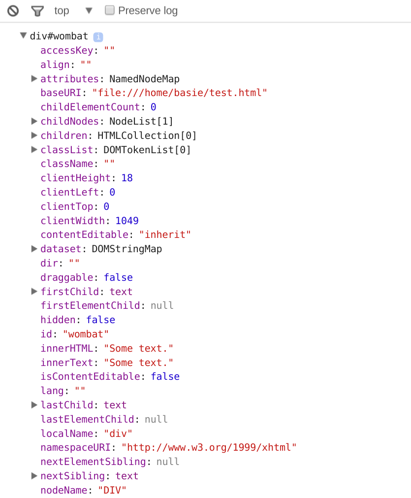
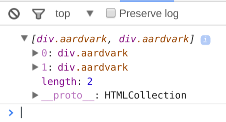

# JavaScript events and CSS classes

## Revisiting the Document Object Model

In your studies so far you've probably come across the term _DOM_: the **D**ocument **O**bject **M**odel. You may recall that this is the collection of _elements_ that make up a web document organised into a tree structure. Here's an example (credit [University of Washington CSE](http://courses.cs.washington.edu/courses/cse190m/07sp/lectures/slides/08-dom.html)):


We can modify this structure and the elements within it using JavaScript. To do so, we follow essentially the same steps each time.

### 1. ***Find*** the element

In native JavaScript there are various ways of finding the element ('tag') we're looking for:

  * [`getElementById`](https://developer.mozilla.org/en-US/docs/Web/API/Document/getElementById)
  * [`getElementsByClassName`](https://developer.mozilla.org/en-US/docs/Web/API/Document/getElementsByClassName)
  * [`getElementsByName`](https://developer.mozilla.org/en-US/docs/Web/API/Document/getElementByName)
  * [`getElementsByTagName`](https://developer.mozilla.org/en-US/docs/Web/API/Document/getElementByTagName)
  * [`getElementsByTagNameNS`](https://developer.mozilla.org/en-US/docs/Web/API/Document/getElementByTagNameNS)

For the purposes of the Sprint 5 and 6 assignments we're going to be using the first two. These are our ways of going out into the DOM and grabbing the element we want to manipulate or gain information about.

There are some important differences between them. Let's look at `getElementById` first:

```javascript
<div id="wombat">Some text.</div>
<script>
  var wombat = document.getElementById('wombat')
  console.log(wombat.outerHTML)
</script>
```

Output:

```javascript
<div id="wombat">Some text.</div>
```

That's a representation of a DOM element as a string. However, take a look at this:

```javascript
<div id="wombat">Some text.</div>
<script>
  console.dir(document.getElementById('wombat'))
</script>
```

Output:



Whoa. That's a lot of properties for a single `div`! We can't even fit them all on one screen. (If you only see the first line, try left-clicking on the arrow next to `div#wombat`.)

So as it turns out, using `getElementById` returns an object which has all kinds of properties and functions that we can use to alter its appearance and behaviour in JavaScript.

What happens if we try to use `getElementById` when the element doesn't have an id?

```javascript
<div>Some text.</div>
<script>
  var wombat = document.getElementById('wombat')
  console.log(wombat)
</script>
```

Output:

```javascript
null
```

That's not too surprising: you can't find an id that doesn't exist, after all. Ok, so what about `getElementsByClassName`? First thing to notice is that it's a _plural_: it returns an array.

```javascript
<div class="aardvark">One aardvark.</div>
<div class="aardvark">Another aardvark.</div>
<script>
  var aardvarks = document.getElementsByClassName('aardvark')
  console.log(aardvarks)
</script>
```

Output:



Note the `length` property is equal to two. The return type of `getElementsByClassName` is an array because we don't know how many elements will have that class: there could be hundreds! In HTML5 id attributes are unique, but classes can be shared by many elements. Even if there were only one element with the class `aardvark`, we'd still get an array with length 1.


### 2. Add an ***event listener***

Event listeners are like little triggers attached to your DOM elements that _fire_ when the user does something with the element. Most frequently these are mouse or keyboard events:

  * 'click'
  * 'mouseenter'
  * 'keyup'

There are many more. You can check out the list on the [MDN Event reference](https://developer.mozilla.org/en-US/docs/Web/Events).

To add an event listener to a DOM element, we find the element using the techniques above, and then call `addEventListener` on the object that is returned:

```javascript
<div class="wombat">A wombat.</div>
<script>
  var wombats = document.getElementsByClassName('wombat')
  var theFirstWombat = wombats[0]
  theFirstWombat.addEventListener('click', function (evt) {
    evt.target.style.backgroundColor = 'red'
  })
</script>
```

There's quite a bit going on here, so take some time with it. First we get _all_ the wombats, then from that array we choose the _first_ wombat in the document. That's an object with a function `addEventListener`. Take a closer look at the function call:

```javascript
  theFirstWombat.addEventListener('click', function (evt) {
    evt.target.style.backgroundColor = 'red'
  })
```

Here we pass an _anonymous function_ with one parameter named `evt`. The name is arbitrary, but we can't use `event` because it's a reserved word in JavaScript. Some people like to use `e`.

`evt` is an object that JavaScript passes us with all the information about the event:

  * what happened (a 'click')
  * what element it affected (a div with class `wombat`)

The element directly affected by an event is called the _target_. The target is just another DOM element, and has all the useful properties on it for us to play with. One of those is `style`, so we can set `style.backgroundColor` and it will change to whatever we like when the element is clicked.

We don't have to use an anonymous function; in fact, for most non-trivial purposes, we probably shouldn't. We can define a named function and use it instead:

```javascript
  theFirstWombat.addEventListener('click', makeRed)

  function makeRed (evt) {
    evt.target.style.backgroundColor = 'red'
  })
```

This is a little cleaner and can make testing and debugging easier.


## Working with lots of elements at once

What if we wanted to add an event listener to all the objects of one class, even if we didn't know ahead of time how many there were going to be? Well, DOM elements are treated in JavaScript as arrays of objects, and just like any other array they can be looped through:

```javascript
  <div class="aardvarks">One aardvark.</div>
  <div class="aardvarks">Another aardvark.</div>
  <div class="aardvarks">A third aardvark.</div>
  var allTheAardvarks = document.getElementsByClassName('aardvark')

  for (var i = 0; i < allTheAardvarks.length; i++) {
    allTheAardvarks[i].addEventListener('dblclick', makeBlue)
  }

  function makeBlue (evt) {
    evt.target.style.backgroundColor = 'blue'
  }
```

Here we're adding listeners to every `div.aardvark`, whereby if the user double-clicks on any of them the background of that div will change to blue.


## Passing elements to other functions

Sometimes once we've found an element we'd like to send it to another function to be acted on in some way. Elements are just JavaScript objects, so we can do that easily enough:

```javascript
  <div id="wombat">Still just a wombat.</div>
  <script>
    var wombat = document.getElementById('wombat')
    showInfo(wombat)

    function showInfo (element) {
      console.log(
        'This element has id: ' + element.id +
        ' and has the contents: ' + element.innerHTML
      )
    }
  </script>
```

Output:

```
This element has id: wombat and has the contents: A wombat.
```
